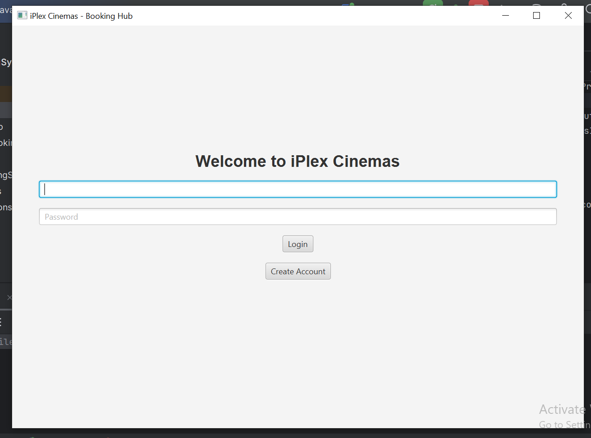
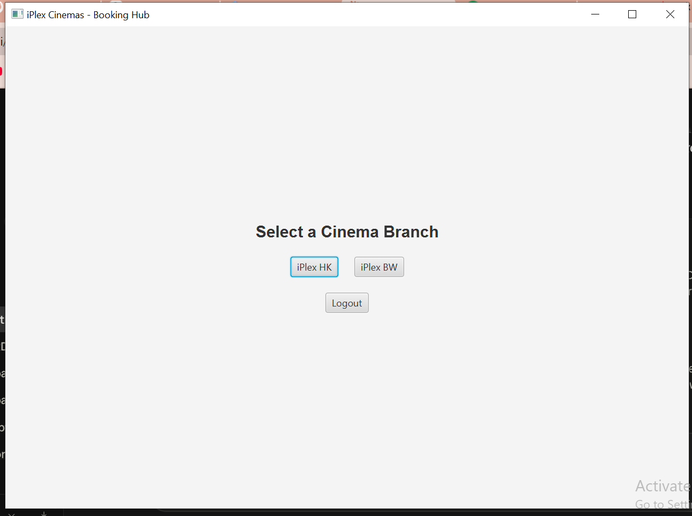
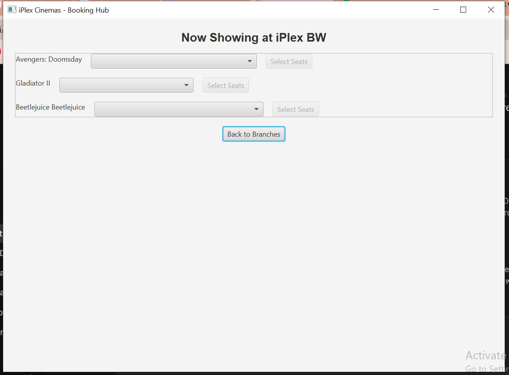
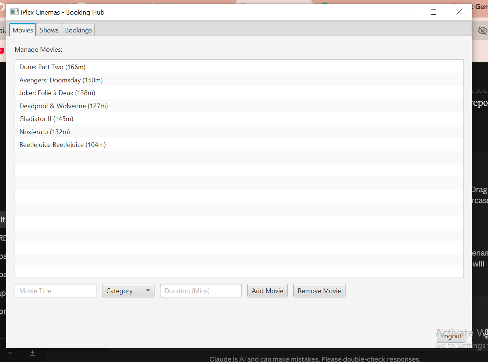
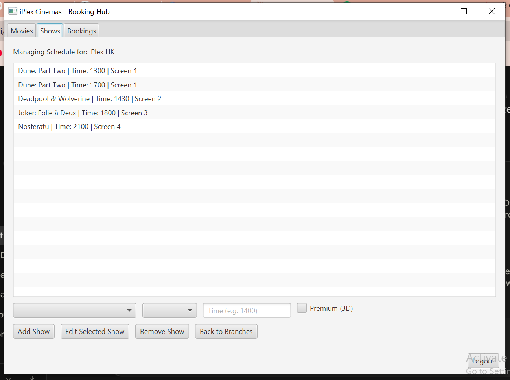
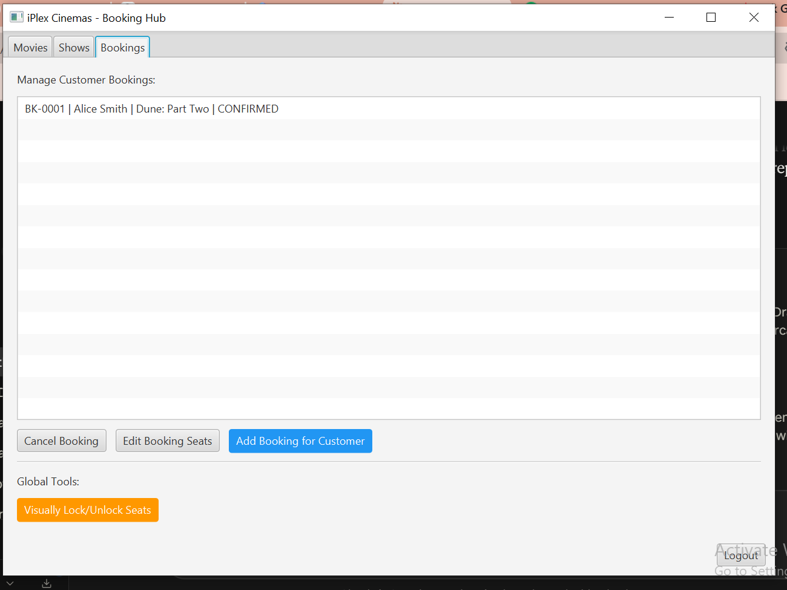

# iPlex Cinemas – Cinema Booking System

This is my second university project, developed using **Java** and **JavaFX**. It builds on what I learned in my first project (an Inventory Management System) with a more advanced application: a full cinema ticket booking platform featuring detailed customer booking flows, an expanded admin toolset, and a dedicated super admin role.



## Overview

iPlex Cinemas is a simulated multi-branch cinema booking platform. Customers can log in, browse movies playing at different branches, pick a showtime, select seats on an interactive seat map, and confirm a booking with full ticket details. Admins get a full back-office dashboard to manage movies, showtimes, and customer bookings — including the ability to book on a customer's behalf and manually lock/unlock seats — while a super admin role sits on top to manage the admin team itself.

## Features

### Customer Features
- Create a new account or log in with existing credentials
- Browse cinema branches

  

- View movies currently showing at a selected branch, with available showtimes
- Interactive seat map with Regular and Premium seat types
- Multi-seat selection with live price calculation

  

- Booking confirmation with mock payment processing

### Admin Features
- **Movie Management** – add and remove movies from the catalog, organized by category

  

- **Show Management** – add, edit, and remove showtimes per branch and screen

  

- **Booking Management**
  - Cancel a customer's booking (auto-refunds seats)
  - Edit the seats attached to an existing booking
  - Create a new booking directly on behalf of a customer (auto-registers them if they don't have an account yet)

  

- **Visual Seat Lock Tool** – manually lock or unlock specific seats across any screen (e.g. for maintenance or reserved holds)

### Super Admin Features
- Register new admin accounts, in addition to all standard admin capabilities

## Core Concepts / Domain Model

| Entity | Description |
|---|---|
| **User** | Abstract base class; extended by `Customer`, `Admin`, and `SuperAdmin` |
| **CinemaBranch** | A physical cinema location containing multiple screens |
| **Screen** | A screening room with a grid of seats (Regular/Premium rows) |
| **Movie** | Title, category (Action, Comedy, Drama, Horror, Sci-Fi), and duration |
| **Show** | A scheduled screening of a movie on a specific screen and time, with an optional 3D flag |
| **Seat** | Individual seat with a type (Regular/Premium) and status (Available/Booked/Locked) |
| **Booking** | Links a user, a show, and a set of seats; tracks status and total price |
| **PaymentRecord** | Handles payment processing and refunds for a booking |

## Project Structure

```text
Cinema_Booking_System/
│
├── src/
│   ├── CinemaBookingSystem.java   # Core backend: entities, enums, managers, sample data
│   └── CinemaApp.java             # JavaFX front-end: all UI screens and navigation
│
├── screenshots/                   # App screenshots used in this README
│   ├── screenshot1.png            # Login screen
│   ├── screenshot2.png            # Cinema branch selection
│   ├── screenshot3.png            # Show and seat selection
│   ├── screenshot4.png            # Admin: add movie / category
│   ├── screenshot5.png            # Admin: show editing / adding / cancelling
│   └── screenshot6.png            # Admin: updating / cancelling bookings
│
├── .gitignore
│
└── README.md
```

## How to Run

### Requirements
- **Java JDK** (17 or later recommended)
- **JavaFX SDK** installed
- **IntelliJ IDEA** (or any IDE with JavaFX support)
- JavaFX properly configured as a library/module in your IDE

### Running the Project
1. Clone or download this repository.
2. Open the project in **IntelliJ IDEA**.
3. Configure the JavaFX SDK: `File → Project Structure → Libraries → Add JavaFX SDK lib folder`.
4. Add the required VM options when running, pointing to your JavaFX `lib` folder:
```text
   --module-path "PATH_TO_YOUR_JAVAFX_LIB" --add-modules javafx.controls,javafx.fxml
```
5. Run `CinemaApp.java` (it contains the `main` method and launches the JavaFX application).

### Demo Accounts

The app auto-loads with a few sample accounts for testing:

| Role | Email | Password |
|---|---|---|
| Super Admin | super@cinema.com | super123 |
| Admin | admin@cinema.com | admin123 |
| Customer | alice@mail.com | alice123 |
| Customer | bob@mail.com | bob123 |

## Learning Outcomes

Through this project, I gained practical experience in:

- Object-oriented design (abstraction, inheritance, interfaces) in Java
- JavaFX GUI development with dynamic, state-driven screen navigation
- Managing application state across multiple views (e.g. admin "override" modes)
- Implementing role-based access control (Customer / Admin / SuperAdmin)
- Designing a booking/reservation domain model
- Event handling and form validation with dialogs
- Organizing a multi-class Java project

## University Project

This is my second university software development project, following on from my first project, the Inventory Management System. Compared to that project, this Cinema Booking System involves significantly more advanced features, including:

- A three-tier role system (Customer, Admin, Super Admin) instead of a single-user application
- Detailed, multi-step customer ticket booking (branch → movie → showtime → seat selection → payment)
- A full admin back-office with dedicated tools for managing movies, showtimes, and customer bookings
- Admin-specific overrides, such as booking on behalf of a customer and manually locking/unlocking seats
- A super admin layer for registering and managing admin accounts

Building this project gave me a deeper understanding of object-oriented design, role-based access control, and structuring a larger JavaFX application with multiple interconnected screens and state.

## Future Improvements

- Persist data with a real database instead of in-memory storage
- Add real payment gateway integration
- Add search and filter functionality for movies and showtimes
- Add booking history and e-ticket generation (QR codes)
- Add input validation and stronger error handling throughout the UI
- Add unit tests for booking and seat-management logic

## Author

**Hasnain Abbas**

Cinema Booking System (iPlex Cinemas)
